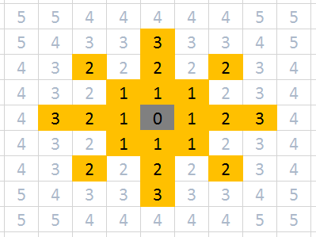

# The Game

The Game for Entelect Challenge 2019 is **Worms**. 

In a match **2** players with **3** worms each will play against each other. The goal is to be the last player with any conscious worms left.

## Contents
* [The Map](#the-map) 
* [The Commands](#the-commands) 
* [Command Order](#command-order) 
* [Scores](#scores) 

## The Map

The game is played on a grid of **32x32** cells. Every cell is one of the following types:
* Air - can be moved into
* Dirt - can not be moved into or shot through, has be dug out first
* Deep Space - can not be interacted with

Cells can contain powerups. Powerups are picked up when a worm moves onto a cell. 
* A Healthpack will immediately restore **5** health to the worm who picks it up. 

Every cell has a coordinate in the form `X,Y` starting from `0,0` in the top left corner and increasing downwards and to the right. 

Two map files will be a available: A json file `state.json` and a text file `state.txt`. In addition the map will be rendered on the console during a running game. 

### Json File

<!-- Example File: @blaarkies todo  -->

<!-- TODO: Extract details to separate file? --> 

##### A file called "state.json", containing the following game details:
* currentRound → *The current round number*
* maxRounds → *The maximum number of allowed rounds for this match*
* mapSize → *The number of rows or columns in the map*
* currentWormId → *The Id number of your worm that is currently in play*
* consecutiveDoNothingsCount → *The number of consecutive **do nothing** commands that you have submitted in this match*
* myPlayer → *Your player's details*
  * id → *The Id number of your player* 
  * score → *Your score points acquired*
  * health → *The sum of all your worms' hitpoints*
  * worms → *The list of all your worms. Worms in this list look like a **[default worm](#default-worm-properties)**, and in addition you can also see these extra attributes of your own worms:*
    * weapon → *The weapon that this worm is capable of using*
      * damage → *The number of hitpoints that this weapon can remove per shot*
      * range → *The distance to which this weapon can affect opponents*
      
      
* opponents → *The player details of your opponents. An example of an opponent looks like the following:*
  * id → *The Id number of this player*
  * score → *This player's score points currently acquired*
  * worms → *A list of all the worms under this player's control. Worms in this list look like a **[default worm](#default-worm-properties)***
  
   
* map → *A list of lists of cells (2d array) describing the map world. Each cell looks like this:
  * x → *An x coordinate number between 0-31 (inclusive)*
  * y → *A y coordinate number between 0-31 (inclusive)*
  * type → *The surface type of this cell (AIR, DIRT or DEEP_SPACE)*
  * occupier → *Any worm occupying this cell will have it's details displayed here, and looks like a **[default worm](#default-worm-properties)***, and in addition this property:
    * playerId → *The Id number of the player in control of this worm* 
    * *If this is your worm, you will also see the extra worm details here*
  * powerup → *The powerup placed in this cell (if any)*
    * type → *The type of powerup (HEALTHPACK)*
    * value → *The strength of this powerup*

##### Default worm properties 
* id → *The Id number of this worm*
* health → *The number of remaining hitpoints for this worm*
* position → *The current position of this worm*
  * x → *An x coordinate number between 0-31 (inclusive)*
  * y → *A y coordinate number between 0-31 (inclusive)*
* diggingRange → *A number describing the range that this worm can dig around itself*
* movementRange → *A number describing the range that this worm can move around itself*
 
### Text File

<!-- Example File: @blaarkies todo  -->

<!-- TODO: Extract details to separate file? -->

##### A file called "state.txt", containing the following game details:
* @&#8203;01 Match Details → Section denoting the overview details
  * Section lines count → *The number of lines in this section*
  * Current round → *The current round number*
  * Max rounds → *The maximum number of allowed rounds for this match*
  * Map size → *The number of rows or columns in the map*
  * Current worm id → *The Id number of your worm that is currently in play*
  * Consecutive do nothing count → *The number of consecutive **do nothing** commands that you have submitted in this match*
  * Players count → *The total number of players stated in this file*
  * Worms per player → *The number of worms denoted to each player stated in this file*

* @&#8203;02 My Player → Section denoting your details
  * Section lines count → *The number of lines in this section*
  * Player id → *The Id number of this player*
  * Score → *This player's score points currently acquired*
  * Health → *The sum of all your worms' hitpoints*
  * Worms → *The list of all your worms. Worms in this list look like a **[default worm](#default-text-worm-properties)**, except that in addition you can also see these extra attributes of your own worms:* 
    * Weapon damage → *The number of hitpoints that this weapon can remove per shot*
    * Weapon range → *The distance to which this weapon can affect opponents* 

* @&#8203;03 Opponents → Section denoting the list of opponents in this match
  * Section lines count → *The number of lines in this section*
  * Player id → *The Id number of this player*
  * Score → *This player's score points currently acquired*
  * Worms → *A list of all the worms under this player's control. Worms in this list look like a **[default worm](#default-text-worm-properties)***

* @&#8203;04 Special Items → Section denoting the special items in this match
  * Section lines count → *The number of lines in this section*
  * HEALTH_PACK → *The amount of hitpoints that this will replenish*

* @&#8203;05 Legend → Section denoting the characters used to draw the map
  * Section lines count → *The number of lines in this section*
  * DEEP_SPACE: ██ *ASCII:219*
  * DIRT: ▓▓ *ASCII:178*
  * AIR: ░░ *ASCII:176*
  * HEALTH_PACK: ╠╣ *ASCII:204, 185*
  * WORM_MARKER: 13 *Example for:Player1, Worm3*

 
* @&#8203;06 World Map → Section denoting the current map state
  * Section lines count → *The number of lines in this section*
  * The map is 32 lines long
  * Each cell in the map is made of double characters, thus each line is 64 characters long

##### Default text worm properties 
* Worm id → *The Id number of this worm*
* Health → *The number of remaining hitpoints for this worm*
* Position x → *An x coordinate number between 0-31 (inclusive)*
* Position y → *A y coordinate number between 0-31 (inclusive)*
* Digging range → *A number describing the range that this worm can dig around itself*
* Movement range → *A number describing the range that this worm can move around itself*

### Console

<!-- TODO: Extract details to separate file? --> 
##### A file called "console.txt", containing the following game details:
* My Player → *The attributes of your player*
  * H → *The sum of all your worms' hitpoints*
  * S → *Your score points currently acquired*
  * W → *The Id number of the worm you are currently commanding*
* Player {Id} → *A list of opponents and their attributes*
  * H → *The sum of all their worms' hitpoints*
  * S → *This player's score points currently acquired*  
* *A map drawn with double characters per map cell, to describe where entities are*

## The commands

In every round each player can submit one command for their active worm. The active worm will be determined by the game engine and will be indicated in the map files as described above. 

All player commands are validated before executing any commands. Invalid commands (eg. Invalid syntax, moving to an occupied cell) result in the worm doing nothing. 

### Move
The format of the move command is `move x y`

* `x y` is the coordinate of the cell the worm is moving to
* Worms can move to any adjacent air cells (including diagonally)
* Worms can not move to cells occupied by another worm
* Worms can not move to dirt or deep space cells
* If two worms move to same cell in the same turn:
    * Both worms will take damage
    * Worms will either swap places or stay in their current positions (with an equal probability)

### Dig
The format of the dig command is `dig x y`

* `x y` is the coordinate of the cell the worm is digging out
* Worms can dig any adjacent dirt cells (including diagonally)
* Digging a dirt cells will change its type to air
* Two worms digging the same cell in the same turn is a valid move 

### Shoot
The format of the shoot command is `shoot {direction}`

* `{direction}` can be any of the eight principal directions: N (North), NE (North-East), E (East), SE (South-East), S (South), SW (South-West), W (West), NW (North-West)

* Shooting distance is measured in [euclidean distance](https://en.wikipedia.org/wiki/Euclidean_distance). To determine if a cell is in range, calculate its euclidean distance from the worm's position, round it downwards to the nearest integer (floor), and check if it is less than or equal to the max range
* Shots are blocked by dirt and deep space cells
* The first worm in range in the shooting direction will lose health equal to the weapon's damage (this could be one of your own worms too)
* When a worm's health is 0 or lower, it will fall unconscious and be removed from the map 

The two diagrams below illustrates how a worm can shoot with a maximum range of 3 and 4 respectively:

### Do Nothing
The`nothing` command can be used when a Player does not want to do anything. Any invalid commands will also be considered as doing nothing. 

If a player does nothing for **10** consecutive turns, their bot will be considered invalid and they will be disqualified from the match.

## Command Order

All commands submitted in a round will be evaluated in the following order:
1. Movement
2. Digging
3. Shooting

This implies the following regarding command interaction:
* A worm can not move into a cell that another worm is digging open in this round
* A worm can dig open a path for another worm's shot
* A worm can move into range of another worm's shot
* A worm can move out of range of another worm's shot 

## Scores

Player scores will only be considered in the case of a tie:
* The maximum amount of rounds (**200**) have passed and there is more than one player left
* If both players lost their last worm in the same round 

The total score value is determined by adding together the points for every single command the player played: 
*  Attack:
    * Shooting a worm gives **5** points
    * Shooting a worm unconscious gives **5** bonus points, for a total of **10**
    * A missed attack gives **2** points  
* Moving gives **1** point
* Digging gives **3** points
* Doing nothing gives **0** points
* An invalid command makes the player **lose 1** point
